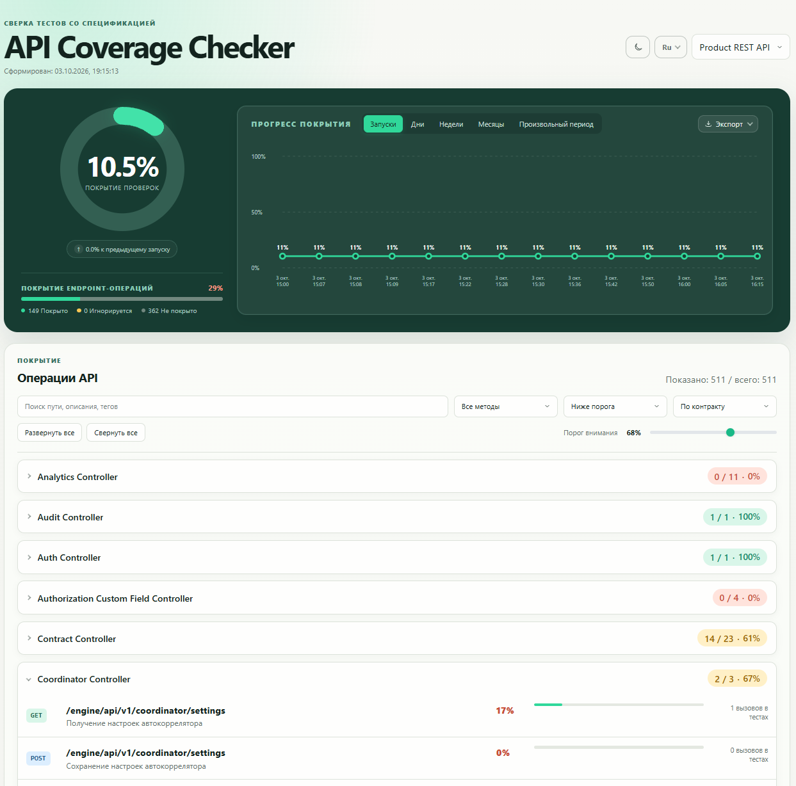
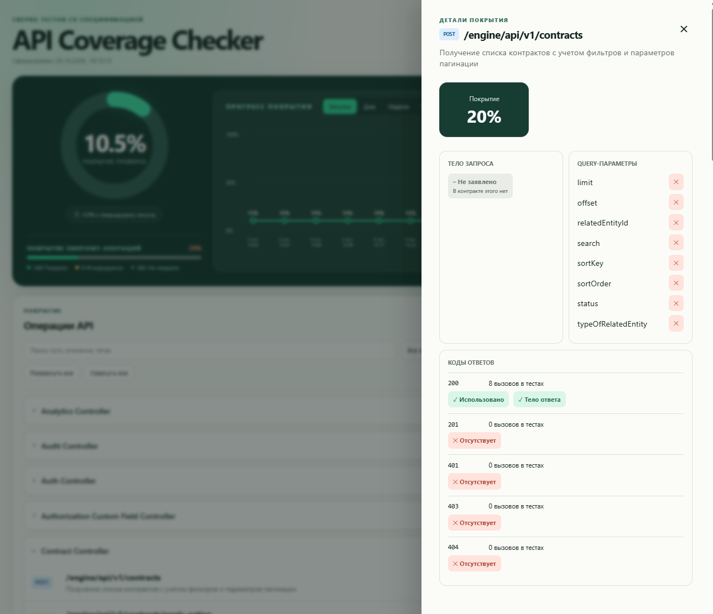

# API Coverage Checker

Local tool that records API test calls and compares them with an OpenAPI contract. The result is a static HTML page. No server and no cloud key.

1. Tests write one JSON file per call into `acc-journal/`.
2. `acc report` reads those files, loads the spec, and writes `acc-output/index.html` plus `acc-output/report.json`.

## Install and run

Before starting, prepare the project: install Python 3.11 or newer, create and activate its virtual environment, install the project's dependencies and test runner, and make an OpenAPI JSON/YAML specification available locally or by URL. The commands below assume that the correct virtual environment is already active.

For normal use, install the product into the repository that contains your API tests. You do not need to copy that repository or its source code into the API Coverage Checker repository. A typical layout is:

```text
my-project/
├── acc.yaml
├── openapi.yaml
└── tests/
```

Open a terminal in `my-project/` and install the product from GitHub. `my-project` means the root directory of your own product, where its existing automated-test command is run. The API Coverage Checker repository does not need to be placed inside it.

```bash
cd path/to/my-project
python -m pip install "git+https://github.com/avrelin-aleksey/api-coverage-checker.git"
```

From `my-project/`, initialize the checker with your existing OpenAPI file:

```bash
acc init --api-key my-api --title "My API" --spec-file ./openapi.yaml
```

This creates `acc.yaml`, `acc-journal/`, and `acc-output/` in the current directory. For a specification served by a URL, use `--spec-url http://localhost:8000/openapi.json` instead of `--spec-file`. The command does not replace an existing `acc.yaml` unless you add `--force`. This guide assumes that the existing automated-test setup already integrates with the checker.

Run the usual automated-test command first, then build the report from `my-project/`, the same directory where `acc.yaml` is located:

```bash
# Run the project's usual automated-test command here.
acc report
```

Open `acc-output/index.html` in a browser. The product does not start a web server; `acc report` generates a self-contained static page. On Windows PowerShell use `Start-Process .\acc-output\index.html`; on macOS use `open acc-output/index.html`; on Linux use `xdg-open acc-output/index.html`.

For a clean run, remove the accumulated journal before running the tests again:

```bash
rm -rf acc-journal                       # Linux/macOS
# Windows PowerShell: Remove-Item -Recurse -Force .\acc-journal
```

To update a product installed from GitHub, use the same virtual environment that contains the project's `acc` command. On Windows PowerShell, run this in `my-project/`:

```powershell
.\.venv\Scripts\python.exe -m pip install --upgrade --force-reinstall --no-cache-dir "git+https://github.com/avrelin-aleksey/api-coverage-checker.git@main"

# If a new measurement is needed, run the project's usual automated-test command first.
.\.venv\Scripts\acc.exe report
Start-Process .\acc-output\index.html
```

On Linux/macOS use the corresponding interpreter and executable:

```bash
./.venv/bin/python -m pip install --upgrade --force-reinstall --no-cache-dir "git+https://github.com/avrelin-aleksey/api-coverage-checker.git@main"
./.venv/bin/acc report
```

The explicit `.venv` paths are important: `pip` and `acc` from another Python installation can leave the project using an older checker. `--force-reinstall --no-cache-dir` makes pip fetch the current GitHub revision instead of reusing an installed VCS copy. Do not run `acc init` again during an update: it is only for the first setup. The update does not remove `acc.yaml`, `acc-journal/`, or the saved history in `acc-output/history.json`. Installing the package does not change an existing HTML file until `acc report` is run.

If the page still looks old, verify which revision is installed:

```powershell
Get-Content .\.venv\Lib\site-packages\api_coverage_checker-*.dist-info\direct_url.json
```

The file should contain the current GitHub commit, not an older commit ID. Also open the report only after running `.\.venv\Scripts\acc.exe report`.

If you did not run the automated tests, `acc report` keeps the last saved report when `acc-journal/` is empty, so the coverage counters and operation details are not replaced with zeros. If the journal still contains calls, the report is rebuilt from them. If the journal was cleared and you need a new measurement, run the tests again before building the report.

Clone the API Coverage Checker repository itself only when you are developing the checker or its report UI. For normal interaction with the checker, the GitHub installation above is enough.

`acc report --fail-under 80` also writes the report, but exits with code 1 when the lowest API score is below 80.

## Record

```python
import httpx
from api_coverage_checker import ApiRecorder

recorder = ApiRecorder("shop")

@recorder.httpx("/users/{user_id}")
def read_user(user_id: str):
    return httpx.get(f"http://localhost:8000/users/{user_id}")
```

Use the contract path template, not `/users/42`. For the `requests` library, use `recorder.requests`.

## Config

`acc.yaml` in the working directory. Override the file with `ACC_CONFIG`. Path overrides: `ACC_JOURNAL_DIR`, `ACC_PAGE_PATH`, `ACC_DATA_PATH`, `ACC_HISTORY_PATH`, `ACC_MINIMUM_SCORE`.

```yaml
apis:
  - key: shop
    title: Shop API
    spec_url: http://localhost:8000/openapi.json
    skip:
      - path: /health
      - path: /docs*
      - text: "*internal*"
      - method: OPTIONS
      - tag: infra
history_limit: 90
minimum_score: 80
```

`spec_file` accepts JSON or YAML, including local `$ref` pointers.

## Report page

Open `acc-output/index.html`. The header switches language and theme; the choice stays in the browser. The ring is **detail coverage**: the average of covered checks inside active operations, including calls, response codes, bodies, and query parameters. The endpoint coverage block below the ring summarizes how many operations are covered, uncovered, or ignored:



- **Covered** — operations that tests called at least once.
- **Uncovered** — operations with no calls. They pull the percentage down.
- **Ignored** — operations matched by `skip`. They are listed at the bottom and do not change the percentage.

Operations are grouped by OpenAPI tags, in the order of the spec. An operation with several tags appears in each of those sections. Operations without a tag sit in **Other**.

Click an operation. The side panel shows that operation’s request body, query names, and response codes:



Each fact is a colored badge:

- Green, **Used**.
- Red, **Absent**.
- Gray, **Not declared** — the contract does not declare this, so it is not a gap.

The facts are the request body, each query name, each response code, and the response body when the contract declares one. Next to a query name the badge is only the mark. Hover it to read **Used**, **Absent**, or **Not declared**.

The **attention threshold** slider starts at 10% and controls the visual status colors without recalculating scores. Section and endpoint summaries use three bands: below half the threshold is red, from half up to (but not including) the threshold is yellow, and the threshold or higher is green. Individual operation percentages below the threshold are red. Changing the slider does not filter the list by itself; the separate “Below threshold” filter uses the selected value. `acc report --fail-under 80` is a separate check: the command exits with code 1 when the lowest API score is below 80. The slider does not set that limit. `minimum_score` in `acc.yaml` is the same limit when `--fail-under` is omitted.

The line chart on the overview is coverage progress. Each `acc report` with measured calls appends one point to `acc-output/history.json`. If the journal is empty and a previous report exists, `acc report` keeps that report and does not add a duplicate point. The journal of calls and this file are separate: clearing `acc-journal/` does not erase the chart. Switch the chart between **Runs**, **Days**, **Weeks**, **Months**, and **Custom period**. Days, weeks, and months keep the last report in each period. `history_limit` (default 90) is how many run points are kept.

In **Custom period**, choose a start and end date. Future dates are disabled, the start cannot be after the end, and the end cannot be before the start. A one-day range produces one daily average; a two-to-fourteen-day range produces one average per day; a longer range is divided into at most 14 equal intervals. Empty intervals remain on the axis but contain no invented value: the line is broken across them. The selected start and end dates are always retained on the axis. The chart shows the change from the previous run. **CSV** downloads a detailed table with summary, history, and all API operations; **Report** downloads the complete self-contained HTML page, which can also be printed to PDF from the browser.

## Skip

`skip` rules live under one API. A rule matches when every field it sets matches:

- `path` — the contract path. `*` is a mask (`/docs*`).
- `method` — `GET`, `POST`, and the other verbs.
- `tag` — an OpenAPI tag.
- `text` — a mask over method, path, summary, and tags together (`*internal*`).

Add one list item for every path or method you want to ignore. Separate list items are alternatives (OR); fields inside one item are combined (AND). This ignores two complete paths, every `OPTIONS` operation, and only `GET` and `POST` for `/admin/users`:

```yaml
apis:
  - key: shop
    title: Shop API
    spec_file: ./openapi.yaml
    skip:
      - path: /health
      - path: /metrics
      - method: OPTIONS
      - path: /admin/users
        method: GET
      - path: /admin/users
        method: POST
```

To ignore all methods of one path, write only `path`. To ignore several methods on the same path, repeat the path in separate items because `method` accepts one method per rule. To ignore a group of paths, use a mask such as `/docs*`.

The ignored block shows which rule matched and the YAML to delete. Remove that rule from `acc.yaml` and run `acc report` again to put the operation back into the percentage.

## CI/CD Integration & Pytest Fixture

### Pytest Fixture Example

```python
import pytest
import httpx
from api_coverage_checker import ApiRecorder

@pytest.fixture(scope="session")
def api_recorder():
    return ApiRecorder("shop")

@pytest.fixture
def recorded_client(api_recorder):
    client = httpx.Client(base_url="http://localhost:8000")
    # Wrap endpoints under coverage tracking
    client.get = api_recorder.httpx("/users/{user_id}")(client.get)
    return client
```

### GitHub Actions Workflow Example

```yaml
name: API Coverage CI

on: [push, pull_request]

jobs:
  test-coverage:
    runs-on: ubuntu-latest
    steps:
      - uses: actions/checkout@v4
      - name: Set up Python
        uses: actions/setup-python@v5
        with:
          python-version: "3.11"
      - name: Install dependencies
        run: |
          pip install -e .
          pip install pytest httpx
      - name: Run test suite
        run: pytest
      - name: Validate OpenAPI spec
        run: acc validate
      - name: Generate Coverage Report
        run: acc report --fail-under 80 --format junit > acc-junit.xml
```

## Docs

- [English](docs/en/guide.md)
- [Русский](docs/ru/guide.md)

## Contributors

Created by **Avrelin Aleksei**. The same line is in the Python modules, the report JSON field `created_by`, and the HTML comment next to the report data. GitHub history at [avrelin-aleksey/api-coverage-checker](https://github.com/avrelin-aleksey/api-coverage-checker) is the public record of that work.

## License

Apache License 2.0. Copyright 2026 Avrelin Aleksei. See [LICENSE](LICENSE) and [NOTICE](NOTICE).
